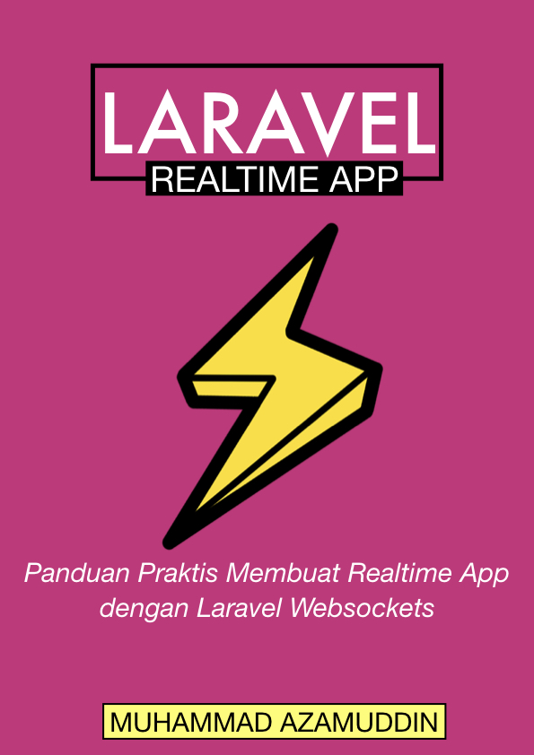

## Demo

Demo App: Feedback Loop  
Dashboard: [http://feedback.arrowfunxtion.com/feedback/dashboard](http://feedback.arrowfunxtion.com/feedback/dashboard)  
Input Feedback : [http://feedback.arrowfunxtion.com](http://feedback.arrowfunxtion.com)  

Gunakan tab / window yang berbeda untuk melihat efek realtime.

## Download ebook

Kamu dapat mendownload ebook ini di sini [https://get.arrowfunxtion.com/download-ebook-gratis---laravel-realtime-app
](https://get.arrowfunxtion.com/download-ebook-gratis---laravel-realtime-app)

## Apakah ebook ini gratis?

Ya, dan kamu boleh membagikan ke siapapun, dan yap, silahkan bagikan jika bermanfaat. Tidak diperbolehkan mengubah sebagian atau keseluruhan konten di ebook ini tanpa seizin penulis.

Link source code ada di bagian penutup ya. Saya tahu ada yang pertama dicari adalah source code.

## Penulis

Muhammad Azamuddin  
Email: mas.azamuddin@gmail.com  
Facebook: [https://facebook.com/script.holic](https://facebook.com/script.holic)
